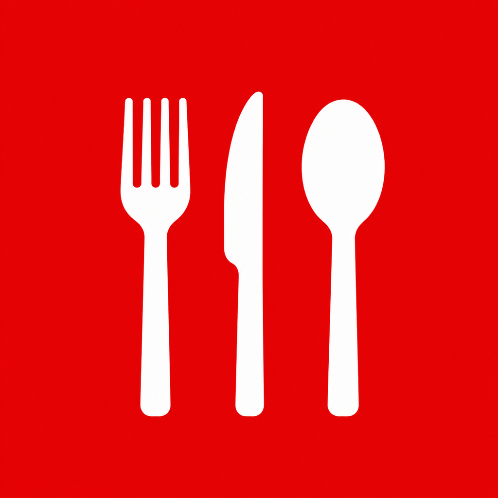

# Thrice

Thrice keeps your recipes, weekly meal plan, shopping list, pantry and food log in one place. This plugin connects your assistant to your Thrice account so you can plan the week, save a recipe straight into your library, build your shopping list, see what you can make with what's on hand, and log what you ate, all from the chat. It adds and updates the way the app does, and never deletes anything.

## What's included

- **The Thrice connector**: a remote MCP server at `https://cookthrice.com/mcp`.
- **Skills** that show the assistant how to use it well:
  - `plan-the-week`: plan a week of meals from your saved recipes, fitted to your macro goal and pantry
  - `save-a-recipe`: write a recipe into your library in cooklang, in your units
  - `cook-from-pantry`: what you can make now with what you have, using up what expires first
  - `shop-for-the-plan`: build your shopping list from the plan, skipping what's in the pantry
  - `log-meals`: log what you ate with macros, and check progress against your goal

## Tools

**Read**

| Tool | What it does |
|---|---|
| `search` | Searches your saved recipes and tips |
| `fetch` | Returns the full text of a search result |
| `profile` | Returns the name, handle and email of the connected account |
| `get_overview` | Today at a glance: goal and totals, this week's plan, list, recent cooks |
| `search_recipes` | Lists your recipes, filtered by words, tag, cuisine, favorites or collection |
| `get_recipe` | One recipe in full, optionally scaled |
| `list_collections` | Your collections, shared ones included |
| `get_shopping_list` | Your shopping list |
| `get_pantry` | What you have on hand, and what expires soon |
| `get_meal_plan` | A week of your meal plan |
| `get_diary` | A day of your food log |
| `get_cook_history` | When you cooked what |
| `list_tips` | Your saved cooking tips |

**Add and update**

| Tool | What it does |
|---|---|
| `create_recipe` | Saves a new recipe |
| `update_recipe` | Edits a recipe you own |
| `add_to_shopping_list` | Adds items, or a recipe's ingredients |
| `check_off_shopping_items` | Marks items as bought |
| `log_meal` | Adds a food log entry |
| `set_macro_goal` | Sets your daily targets |
| `plan_meal` | Puts a recipe in your meal plan |
| `unplan_meal` | Takes a meal out of your plan |
| `add_pantry_items` | Adds items to your pantry |
| `add_to_collection` | Adds a recipe to a collection |
| `favorite_recipe` | Favorites or unfavorites a recipe |
| `record_cook` | Records that you cooked a recipe |
| `save_tip` | Saves a cooking tip |

Nothing deletes, changes sharing, or touches your account; that stays in the app.

## Requirements

- A Thrice account (free) at [cookthrice.com](https://cookthrice.com) or in the iPhone and iPad app
- An assistant plan that supports connectors: any Claude plan, or ChatGPT Plus, Pro, Business or Enterprise

## Setup

Install the plugin, then connect Thrice when prompted: sign in to Thrice and click **Allow access**. Authentication is OAuth; there's no key to paste. Full instructions: [cookthrice.com/connectors](https://cookthrice.com/connectors).

## Example prompts

- "Plan my dinners this week around my macro goal, using what's already in my pantry."
- "What can I make tonight with what I have?"
- "Write me a weeknight Thai green curry and save it to Thrice."
- "Add everything for Saturday's recipes to my shopping list."
- "Log a turkey sandwich and an apple for lunch."

## What this plugin sends and runs

- The plugin runs no local code, hooks or scripts. Its only component besides the skills is the remote Thrice MCP server.
- When the assistant calls a tool, it sends the tool's arguments (search words, a recipe id, the items to add, a recipe it wrote) to `https://cookthrice.com/mcp`. Thrice returns data from your account. Thrice does not receive your conversation.
- The connection uses an OAuth access token you can revoke at any time from your assistant's connector settings or under Connected apps in Thrice's Account Settings.
- The skills are written instructions only. They don't fetch anything themselves.

## Privacy and support

- Privacy policy: [cookthrice.com/privacy](https://cookthrice.com/privacy)
- Terms: [cookthrice.com/terms](https://cookthrice.com/terms)
- Support: support@cookthrice.com

## License

MIT. See [LICENSE](LICENSE).
